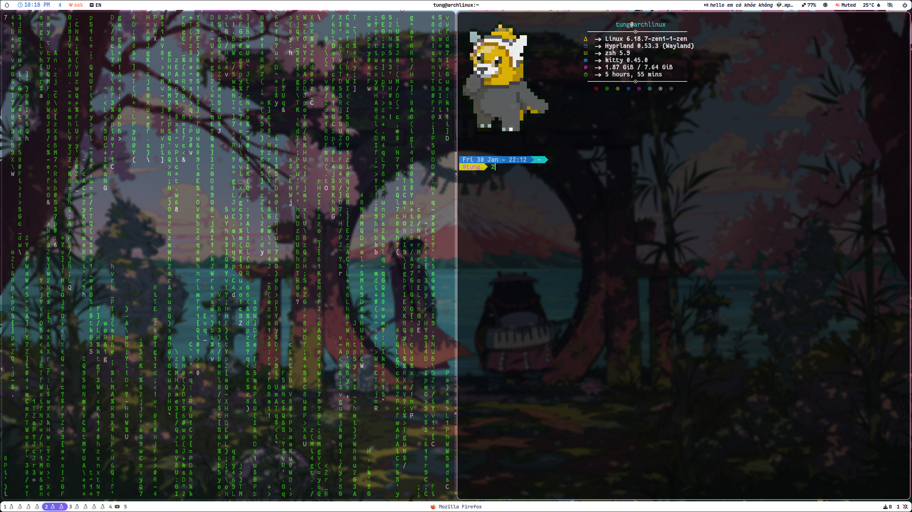
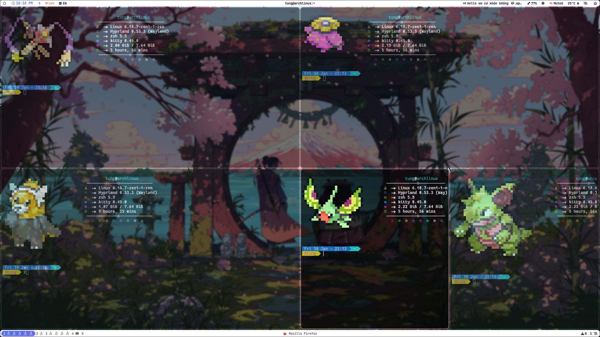
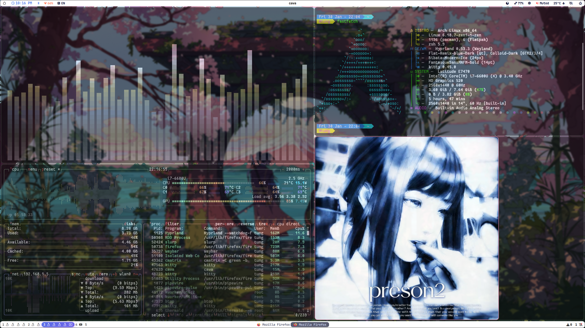

# 💎 Luxury White Waybar Setup
A clean, aesthetic and rực rỡ setup for Arch Linux + Hyprland.

## ✨ Preview


<p align="center">
  
  
</p>

## 🚀 Cài đặt siêu tốc (Automatic Install)
Chỉ cần một lệnh duy nhất để có ngay giao diện rực rỡ:

```bash
git clone https://github.com/vuphitung/Desktop-Dotfiles.git
cd Desktop-Dotfiles
chmod +x install.sh
./install.sh
```

## 📦 Yêu cầu hệ thống (Dependencies)
Script sẽ tự cài, nhưng bro cũng có thể cài thủ công:
- **Font**: `ttf-jetbrains-mono-nerd`
- **Bar**: `waybar`
- **Tools**: `btop`, `cava`, `cmatrix`

---
*Cung điện này được tinh chỉnh bởi **Vuphi Tung** 🚀*
